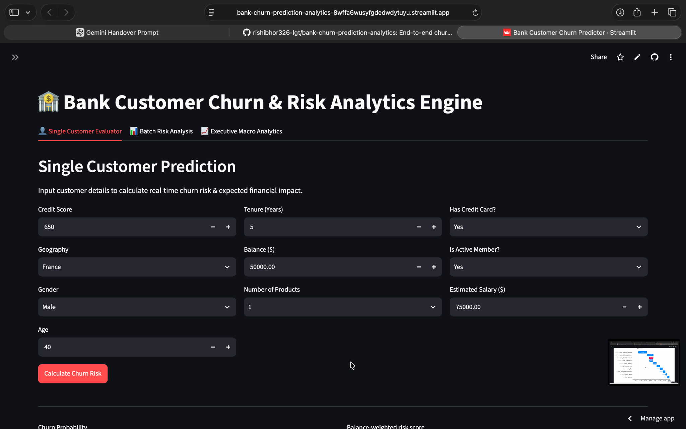
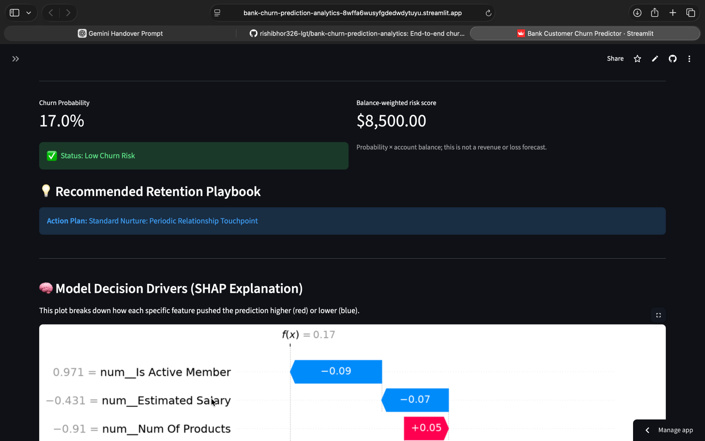
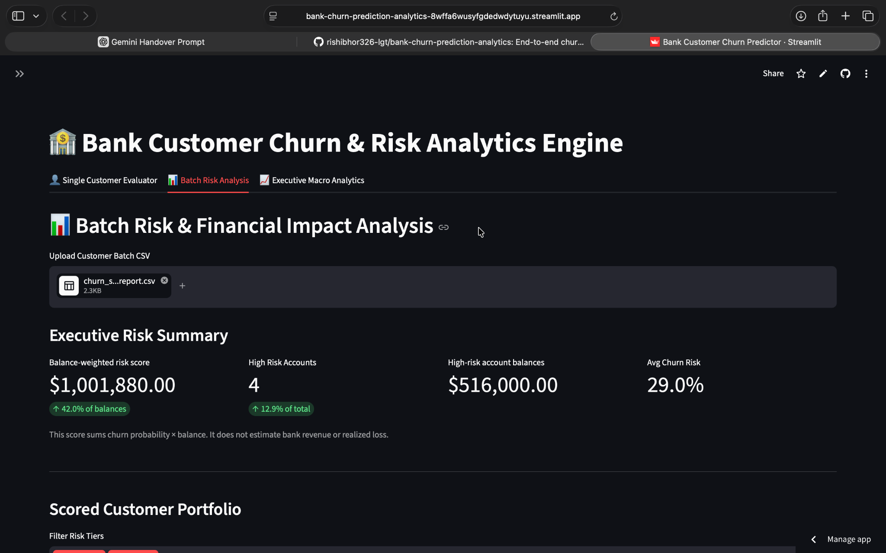
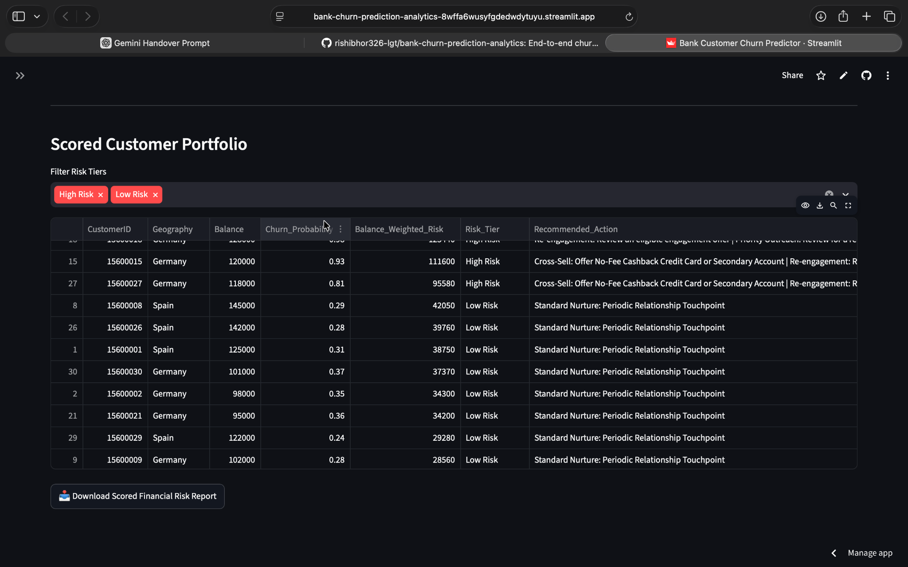
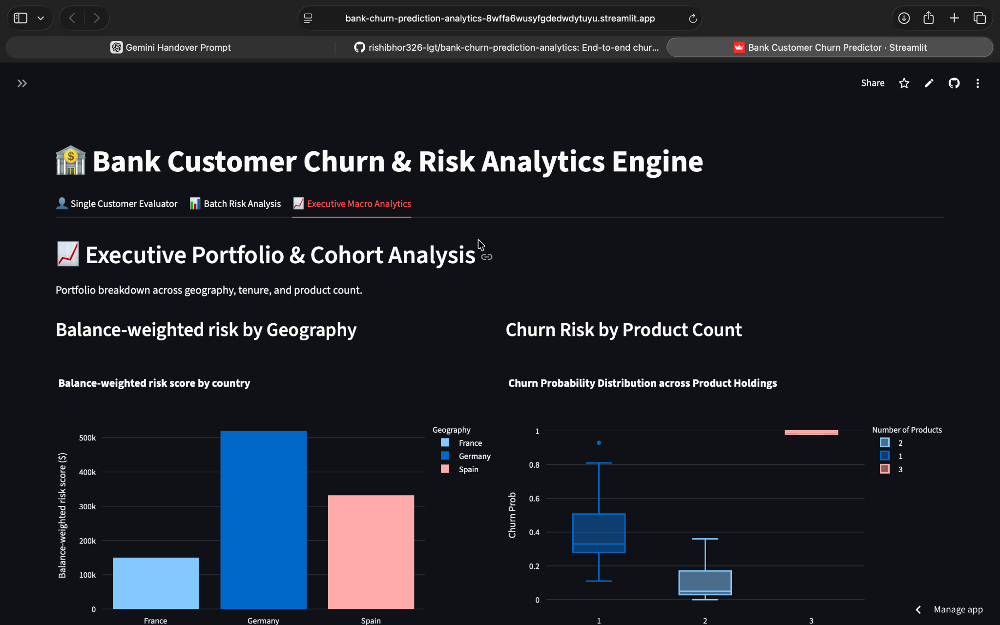

# Bank Customer Churn Prediction & Retention Analytics

An analysis of 10,000 customer records with MySQL queries, a reproducible Python model comparison, and a Streamlit scoring app. `Churn=1` means the customer left; the MySQL table uses the equivalent name `Exited`.

## Live application

[Open the Bank Customer Churn & Risk Analytics dashboard](https://bank-churn-prediction-analytics-8wffa6wusyfgdedwdytuyu.streamlit.app/)

## Dashboard preview

<p align="center">
  
  
</p>

<p align="center"><strong>Single-customer scoring and explainable model output</strong></p>

<p align="center">
  
  
</p>

<p align="center"><strong>Batch risk KPIs, customer prioritization, and scored report export</strong></p>

<p align="center">
  
</p>

<p align="center"><strong>Executive cohort analysis by geography and product holdings</strong></p>

## What is in this repository

| File | Purpose |
| --- | --- |
| `Churn_Modelling.csv` | Sample customer data used for training and analysis |
| `sql/01_*.sql` to `sql/04_*.sql` | Data checks and churn segments against `bank_churn.churn_modelling` |
| `train_churn_model.py` | Stratified 80/20 split, Logistic Regression baseline, Random Forest, test metrics, candidate Pipeline |
| `churn_model.pkl` | Existing app model; evaluated below on a reconstructed test split |
| `evaluate_existing_model.py` | Reproduce the read-only evaluation below |
| `predict.py` | Two example predictions using the existing app model |
| `app.py` | Single customer scoring, CSV batch scoring, and portfolio charts |
| `RETENTION_PLAYBOOK.md` | Proposed outreach workflow, risk tiers, and outcome measures |
| `export_powerbi_data.py` | Generates a scored CSV that can be imported into Power BI |

## Run locally

From the repository root, create an environment and install `requirements.txt`. Then:

```bash
python predict.py
streamlit run app.py
```

The app expects `churn_model.pkl` in the repository root. Upload `Churn_Modelling.csv` in the batch tab to see scores and charts. Download the scored CSV from the app. For a Power BI data export, run `python export_powerbi_data.py` and import its CSV into Power BI.

Scores on `Churn_Modelling.csv` are a demo of the app workflow, not an out-of-sample performance evaluation: some rows may have been used to train the saved model.

## Reproduce a model comparison

```bash
python train_churn_model.py
```

This evaluates a Logistic Regression baseline and a Random Forest on the same stratified held-out test set. Preprocessing is fitted only on training data inside each Pipeline. The script prints the confusion matrix, churn-class precision, recall, F1, and ROC-AUC. It saves `churn_model_candidate.pkl` without overwriting the existing app model. Run it in your target Python environment to report exact metrics. The reported scores apply to this candidate, not automatically to the existing `churn_model.pkl`.

## Existing app model: independent check

Run `python evaluate_existing_model.py` to load the committed `churn_model.pkl` and evaluate it against a stratified 20% split of `Churn_Modelling.csv` using `random_state=42`. With a 0.5 classification threshold, the 2,000-row split produced:

| Metric for churn class | Value |
| --- | ---: |
| ROC-AUC | 0.8578 |
| Precision | 0.6171 |
| Recall | 0.6216 |
| F1 | 0.6193 |
| Confusion matrix (TN, FP, FN, TP) | 1436, 157, 154, 253 |

The train portion scored ROC-AUC 1.0000 and the test portion 0.8578, which is consistent with the model having seen the train portion. The original training source and split indices for this saved artifact are not in the repository, so this reconstructed split cannot prove the model was never trained on test rows. The historical 74% F1 and 78% recall claims are not supported by this evaluation.

## Business interpretation

SQL analysis found that customers who left were about 20% of accounts but held about 24% of the balances in this sample. This is a balance concentration measure, not bank revenue lost.

The app's balance-weighted risk score multiplies predicted churn probability by balance. It supports prioritization, but does not forecast actual withdrawal, revenue, or retention return. Recommended outreach actions are rules for review, not tested interventions. The 0.4 and 0.7 risk tier cutoffs are illustrative; validate them against outreach capacity and observed outcomes before operational use.

The Streamlit application is publicly deployed at the link above. The repository also contains a CSV export that can be imported into Power BI; it does not include a `.pbix` report.

## Author

Rishi Bhor
